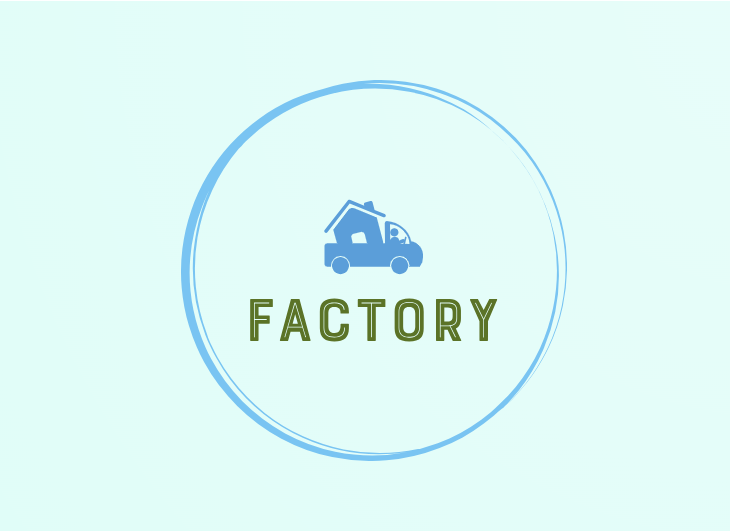

<p align="center">

</p>
<p align="center">
<a href="https://pkg.go.dev/github.com/erfanmomeniii/factory?tab=doc"target="_blank">
    
</a>


</p>

# factory

`factory` is a lightweight package for generating fake data that helps generate realistic but fictional data for various purposes, such as testing, prototyping, or populating databases with sample data.

# Documentation

## Install

```bash
go get github.com/erfanmomeniii/factory
```   

Next, include it in your application:

```bash
import "github.com/erfanmomeniii/factory"
``` 

## Quick Start
The following examples illustrates how to use this package:

```go
package main

import (
	"fmt"

	"github.com/erfanmomeniii/factory"
)

type Name struct {
	FirstName string
	LastName  string
}
type Info struct {
	Name  Name
	Phone int
}

func main() {
	f := factory.NewFactory()

	instances := f.Model(Info{}).
		Generate(2)

	for _, i := range instances {
		instance := i.(Info)
		fmt.Println("Name : ", instance.Name.FirstName+" "+instance.Name.LastName, " | Phone : ", instance.Phone)
	}
}
```

## Contributing
Pull requests are welcome. For changes, please open an issue first to discuss what you would like to change.
Please make sure to update tests as appropriate.
